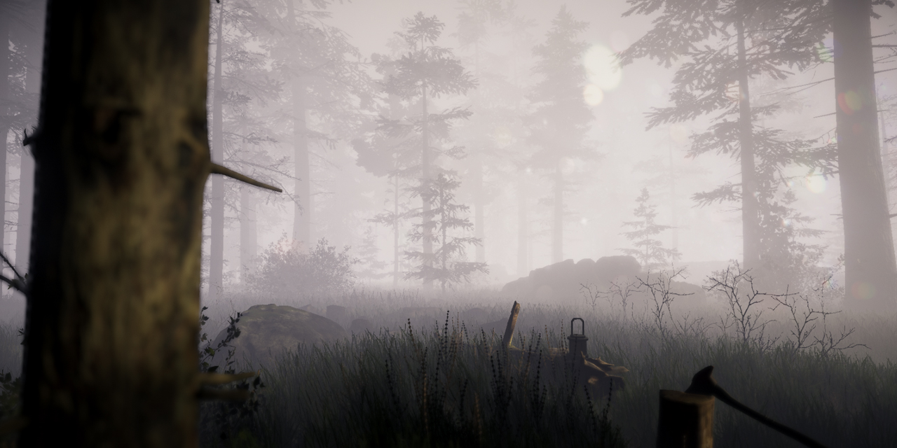
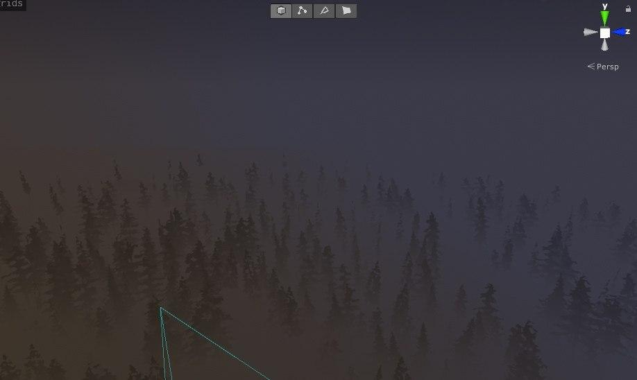

# Height-Fog V2
This is NOT volumetric fog, it's an image effect. It is based on same math, but analytical and as such, doesn't have support for shadows and other effects you'd expect from volumetrics

# How to use
Like any Post Processing V2 shader. Add it as effect to Post Process volume.

Fog is applied only to opaque geometry by default, to support semi transparent objects you need to use "FogVolume_ApplyFog" method in "HeightFog.hlsl" file

### Fragment shader version
```c
#include "HeightFog.hlsl"
// <Optional>
#pragma multi_compile _ _HEIGHT_FOG_ENABLED

struct v2f
{
    float3 wpos : VAR_WORLDPOS;
}

v2f vert (appdata v)
{
    v2f o;
    //...//
    o.wpos = mul(unity_ObjectToWorld, v.vertex);
    //...//
    return o;
}

fixed4 frag (v2f i) : SV_Target
{
    fixed4 col = tex2D(_MainTex, i.uv);
    
#if _HEIGHT_FOG_ENABLED // <optional guard, if you don't want more shader variants you can omit the #if>
    col = FogVolume_ApplyFog(i.wpos, col);
#endif 
    return col;
}

```

### Surface shader version
```c
#include "HeightFog.hlsl"
#pragma surface surf Standard alpha:auto finalcolor:compute_fog
//                                       ↑ add this

void compute_fog (Input IN, SurfaceOutputStandard o, inout float4 color)
{
    color = FogVolume_Apply(IN.worldPos, color);
}                                              
```

## References
[Frostbite - Physically-based & Unified Volumetric Rendering](https://www.ea.com/frostbite/news/physically-based-unified-volumetric-rendering-in-frostbite)
[Volumetric Fog. B.Wronski](https://bartwronski.com/wp-content/uploads/2014/08/bwronski_volumetric_fog_siggraph2014.pdf)
[Creating the Atmospheric World of Red Dead Redemption 2](https://advances.realtimerendering.com/s2019/index.htm)