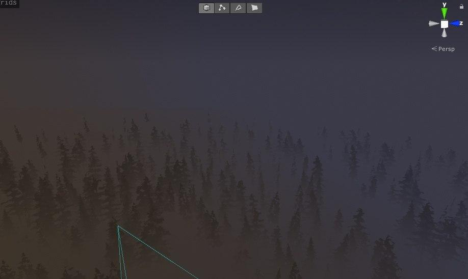

# Height-Fog
 Height fog implementation for Unity. Work in progress.
 This is NOT volumetric fog, it's an image effect. Right now some settings don't actually do anything
 # How to use
Like any Post Processing V2 shader. Add it as effect to Post Process volume.
Though it does not support transparent geometry (And won't do it by default)

To enable support in custom shaders you need to include "HeightFogUsage.hlsl" and then use ApplyFog function. In the end it will look like this
```c
//...
#include "HeightFogUsage.hlsl"
#pragma multi_compile HF_LIGHT_ATTEN // Add this to use directional light if enabled
//...
struct v2f
{
    float3 wpos : TEXCOORD0;
}
//...//
v2f vert (appdata v)
{
    v2f o;
    //...//
    o.wpos = mul(unity_ObjectToWorld, v.vertex);
    //...//
    return o;
}
//...//

fixed4 frag (v2f i) : SV_Target
{
    fixed4 col = tex2D(_MainTex, i.uv);
    col.rgb = ApplyFog(col.rgb, i.wpos);

    return col;
}

```
You can also try to use this function in surface shaders in "Finilize Color" function. Though I did not test it

Thanks [this](https://github.com/keijiro/DepthInverseProjection/blob/master/Assets/InverseProjection/Resources/InverseProjection.shader) repository for inverse projection code Xd