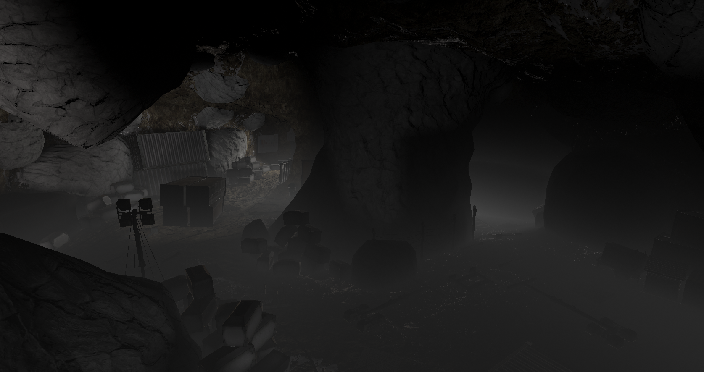

# Height-Fog
 Height fog implementation for Unity. Work in progress
 # How to use
Like any Post Processing V2 shader. Add it as effect to Post Process volume.
Though it does not support transparent geometry (And won't do it by default)

Thanks [this](https://github.com/keijiro/DepthInverseProjection/blob/master/Assets/InverseProjection/Resources/InverseProjection.shader) repository for inverse projection code Xd